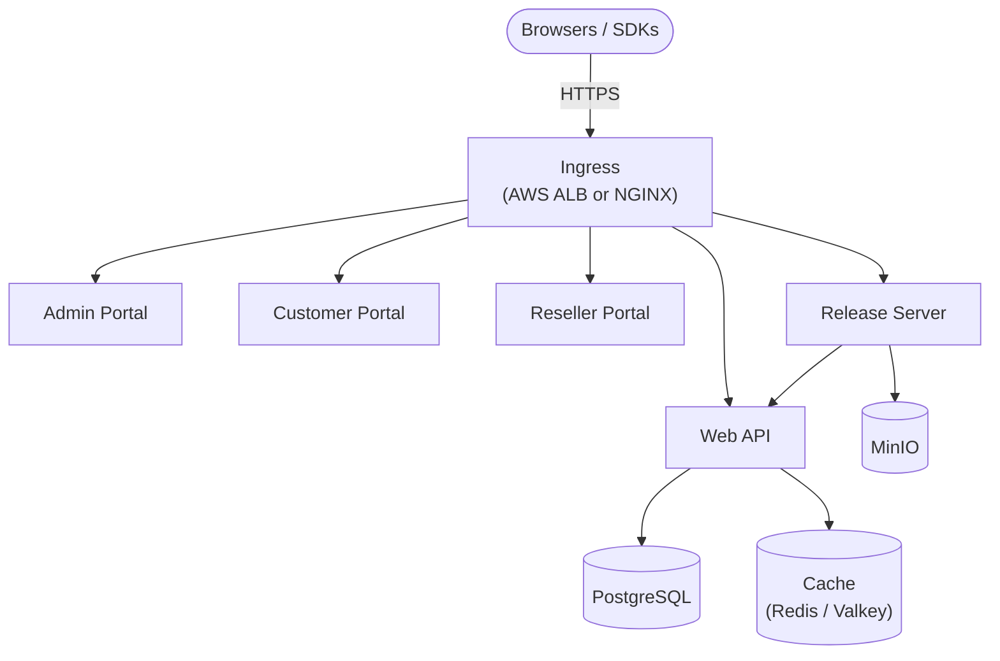

# Cryptlex Helm Charts

Deploy the complete Cryptlex platform (Web API, Web Portals, and Release Server) on Kubernetes with high availability, using the [cryptlex-enterprise](cryptlex/cryptlex-enterprise) Helm chart. It has all the features of SaaS Cryptlex, and regular chart releases keep you up to date.

This repository is for high-availability deployments on Kubernetes. For single-server deployments using Docker Compose, use [cryptlex-on-premise](https://github.com/cryptlex/cryptlex-on-premise).

## Architecture



The chart deploys the following workloads:

| Workload        | Purpose                                                | Notes                                                                                       |
| --------------- | ------------------------------------------------------ | ------------------------------------------------------------------------------------------- |
| Web API         | Cryptlex Web API                                       | Replicas set by `webApi.replicaCount`; set it to `3` for production.                        |
| Admin Portal    | Web Portal for your team                               | Enabled by default.                                                                          |
| Customer Portal | Web Portal for your customers                          | Enabled by default.                                                                          |
| Reseller Portal | Web Portal for your resellers                          | Enabled by default.                                                                          |
| Release Server  | Handles upload and download of releases                | Deployed while `services.filestore.enabled` is `true`. Disable it if you don't use [release management](https://cryptlex.com/docs/release-management/overview). |
| PostgreSQL      | Database storing all Cryptlex data                     | Single pod; use an external database for production (see below).                            |
| Redis           | Cache                                                  | Single pod; supports an external Redis-compatible cache such as Valkey instead.             |
| MinIO           | S3-compatible object storage for release files         | Single pod; supports an external S3-compatible store instead.                               |
| RabbitMQ        | Message queue                                          | Disabled by default; requires the [RabbitMQ Cluster Operator](https://www.rabbitmq.com/kubernetes/operator/operator-overview) when enabled in-cluster. |

For a highly available deployment, run the Web API with 3 replicas and use externally managed PostgreSQL and Redis; the in-cluster database, cache, and filestore run as single pods, so they are not highly available.

## Requirements

- A Cryptlex license key and Docker Hub credentials with access to the private Cryptlex images. If you are installing for the first time, [contact us](https://cryptlex.com/contact) to schedule a guided installation.
- A Kubernetes 1.28+ cluster with `kubectl` configured to connect to it, and Helm 3.
- A default StorageClass, only needed when running the database or filestore in-cluster.
- Five sub-domains for the services, for example:

| Sub-domain (example)                      | Service         |
| ----------------------------------------- | --------------- |
| `cryptlex-api.mycompany.com`              | Web API         |
| `cryptlex-admin-portal.mycompany.com`     | Admin Portal    |
| `cryptlex-customer-portal.mycompany.com`  | Customer Portal |
| `cryptlex-reseller-portal.mycompany.com`  | Reseller Portal |
| `cryptlex-releases.mycompany.com`         | Release Server  |

## Installation

### 1. Install an ingress controller

The chart supports AWS ALB (`ingress.className: alb`) and NGINX (`ingress.className: nginx`) ingress.

On AWS, we recommend the [AWS Load Balancer Controller](https://kubernetes-sigs.github.io/aws-load-balancer-controller/). TLS terminates at the load balancer using an [ACM](https://aws.amazon.com/certificate-manager/) certificate that matches your hosts, so cert-manager is not needed.

The [ingress-nginx](https://github.com/kubernetes/ingress-nginx) project is no longer maintained, so prefer ALB or another controller provided by your platform. If you do use NGINX, also install [cert-manager](https://cert-manager.io) so the chart can issue and renew Let's Encrypt SSL certificates for the five domains:

```bash
helm repo add jetstack https://charts.jetstack.io --force-update
helm upgrade --install cert-manager jetstack/cert-manager \
  --create-namespace --namespace cert-manager --atomic \
  --set crds.enabled=true
```

### 2. Configure values

Create a `values.yaml` file. The minimal configuration:

```yaml
imageCredentials:
  username: <docker-username>
  password: <docker-password>

ingress:
  # alb or nginx
  className: alb
  hosts:
    webApiHost: cryptlex-api.mycompany.com
    adminPortalHost: cryptlex-admin-portal.mycompany.com
    customerPortalHost: cryptlex-customer-portal.mycompany.com
    resellerPortalHost: cryptlex-reseller-portal.mycompany.com
    releaseServerHost: cryptlex-releases.mycompany.com

database:
  name: cryptlex
  user: postgres
  password: <strong-password>

filestore:
  accessKey: <access-key>
  secretKey: <secret-key>
  bucket: releases.mycompany.com

webApi:
  # Set to 3 for production.
  replicaCount: 1
  # Appears in email bodies and 2FA secret URLs.
  applicationName: MyCompany
  # The license key for your on-premise Cryptlex server.
  serverLicenseKey: <license-key>
  # Any random string, used to encrypt the RSA private keys and other secrets stored in the database.
  encryptionKey: <random-string>
  # Same value as encryptionKey. Deprecated; will be removed in a future release.
  rsaPassphrase: <random-string>
  # Sender settings so the server can send emails.
  email:
    fromAddress: support@mycompany.com
    fromName: MyCompany Support
    smtp:
      host: <smtp-host>
      port: 587
      username: <smtp-username>
      password: <smtp-password>
```

With NGINX, set the ingress class and enable cert-manager:

```yaml
ingress:
  className: nginx

certmanager:
  enabled: true
  issuer:
    email: you@mycompany.com
```

For production, use externally managed PostgreSQL and Redis:

```yaml
services:
  database:
    external: true
  cache:
    external: true

webApi:
  databaseUrl: postgres://<user>:<password>@<hostname>:5432/<database-name>
  redis:
    url: redis://<hostname>:6379
```

See [values.yaml](cryptlex/cryptlex-enterprise/values.yaml) for all options, including external S3-compatible filestores, RabbitMQ or AWS SQS, and MaxMind GeoIP.

### 3. Install the chart

```bash
helm repo add cryptlex https://cryptlex.github.io/helm-charts --force-update
helm upgrade --install cryptlex-enterprise cryptlex/cryptlex-enterprise \
  --values values.yaml --namespace cryptlex --create-namespace
```

Verify that all pods reach the `Running` state:

```bash
kubectl get pods -n cryptlex
```

### 4. Create DNS records

Get the load balancer address of the ingress:

```bash
kubectl get ingress -n cryptlex
```

At your DNS provider, create the five records from [Requirements](#requirements) as A or CNAME records, all pointing to that address.

With NGINX and cert-manager, the chart issues Let's Encrypt staging certificates first to avoid rate limits. Once they are issued successfully, set `certmanager.issuer.production: true` in your values file and run the `helm upgrade --install` command from step 3 again to switch to trusted production certificates.

### 5. Create your account

Open `https://<adminPortalHost>/auth/signup` in the browser and sign up. Only one account can be created on an on-premise instance.

## Configuring client libraries

By default, Cryptlex SDKs send requests to `api.cryptlex.com`. Point them to your Web API endpoint instead. This is the only integration change; everything else works as described in [Using LexActivator](https://cryptlex.com/docs/node-locked-licenses/using-lexactivator).

**LexActivator**: call `SetCryptlexHost()` (available in all language bindings):

```c
status = SetCryptlexHost("https://cryptlex-api.mycompany.com");
```

**LexFloatServer**: set `cryptlexHost` in its `config.yml`:

```yaml
server:
  cryptlexHost: https://cryptlex-api.mycompany.com
```

## Upgrading

New chart versions are released automatically as Cryptlex service images are updated. To upgrade:

```bash
helm repo update
helm upgrade cryptlex-enterprise cryptlex/cryptlex-enterprise \
  --values values.yaml --namespace cryptlex
```

Pin a specific chart version with `--version <version>` if you want to control when upgrades happen.

> **Note:** The chart pins the in-cluster PostgreSQL version. Once the database has data, moving to a newer major version requires a database migration.

## Monitoring

Cryptlex integrates with [OpenTelemetry](https://opentelemetry.io/) to collect logs, metrics, and traces from your instance, which you can export to any OTel-compatible backend (Grafana, Datadog, New Relic, Elastic, Splunk, etc.) to monitor health, set up alerts, and troubleshoot issues.

Configure it under `webApi.openTelemetry`:

```yaml
webApi:
  openTelemetry:
    # OTLP endpoint of your monitoring backend. Logs are always exported once this is set.
    otlpEndpoint: https://otlp.example.com
    # Export metrics.
    enableMetrics: true
    # Export traces.
    enableTraces: false
    # Headers for backend authentication, as a list of key: value entries.
    # The chart sends them to the backend as comma-separated key=value pairs.
    otlpHeaders:
      - api-key: <key>
```

`webApi.newRelic.applicationName` is optional and only needed if your backend is New Relic.

## Support

For assistance, enterprise inquiries, or deployment guidance, [contact us](https://cryptlex.com/contact).

## License

Commercial software. Contact Cryptlex for licensing details.
